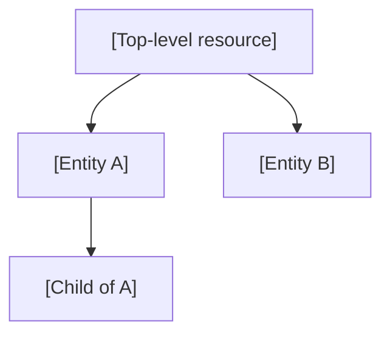

# [Your Service / Product Name] — Test suite onboarding guide

> **How to use this template:**
> Copy this file to `context/ONBOARDING.md` in your project root.
> Replace every `[placeholder]` with your team's actual content.
> The ticket-to-tests agent reads this file at the start of every Phase 1.

---

## Domain glossary

| Term | Meaning |
|---|---|
| **[Entity A]** | [What it is, its lifecycle, how it is identified] |
| **[Entity B]** | [What it is, its relationship to Entity A] |
| **[Role / Permission]** | [Who can do what] |
| **[Auth concept]** | [How authentication works] |
| **[Environment]** | [What QA / staging / production mean for your service] |

---

## Entity / resource hierarchy



Key implications for test design:
- [Scope isolation: each test creates its own top-level resource]
- [Parent references: must be asserted or excluded in validate calls]

---

## Test session authentication flow

```
[Describe how a test session is created]
```

**Token expiry:** [How long tokens last; what to do when they expire]

```bash
# Verify auth is valid:
[your_verify_command]
```

---

## Key project directories

| Path | Purpose |
|---|---|
| `[test_dir_root]/` | Root of the test tree |
| `[context_dir]/` | Reference docs, OpenAPI spec |
| `team_config.yaml` | Project configuration for this skill |

---

## OpenAPI / API specification

- **Local path:** `[openapi.spec_path from team_config.yaml]`
- **Keep current:**
  ```bash
  [your sync command]
  ```

---

## Jira project

- **Project:** [[Your project](https://yourorg.atlassian.net/browse/MYPRJ)]
- **MCP integration:** Use `mcp-atlassian` in Cursor (via `.cursor/mcp.json`)

---

## Notes for the AI agent

> Keep this section updated with gotchas and lessons learned.

- [e.g. Feature X always requires Y to be set up first]
- [e.g. Environment ENV-2 has longer timeouts for job endpoints]
